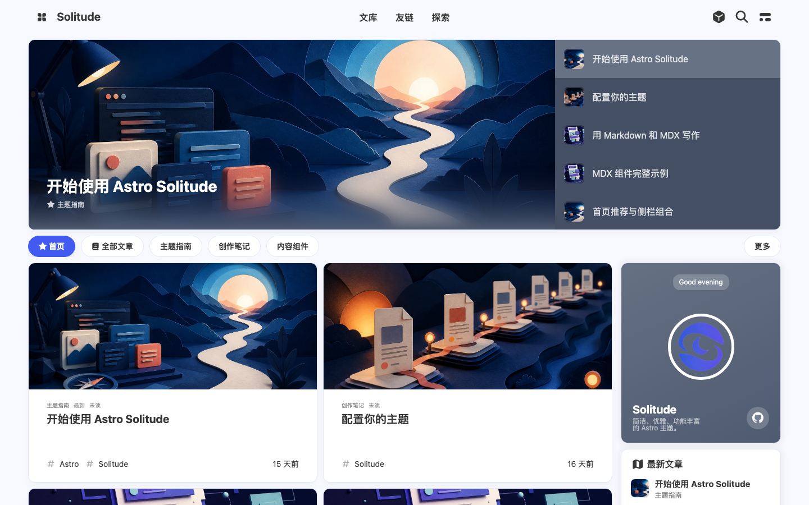

# Astro Solitude

A static Astro blog template ported from Solitude Hugo, preserving its card layout, reading experience, About page effects, styles, and content components. The repository root is a working demo site.

[简体中文](README.md) · [Configuration](docs/configuration.md) · [MDX components](docs/components.md) · [Migration](docs/migration.md) · [Deployment](docs/deployment.md) · [Parity and validation](docs/parity.md)



## Quick start

Use **Use this template** on GitHub, clone your new repository, and install Node.js **22.12.0+** and pnpm (Node.js 24 LTS recommended).

```sh
pnpm install
pnpm dev
```

Set your public URL and theme settings in `src/site.config.ts`. Write Markdown or MDX in `src/content/posts/`, pages in `src/content/pages/`, and store static assets in `public/`.

```sh
pnpm check
pnpm build
pnpm test
pnpm preview
```

The template includes post cards, recommendations, sidebar, TOC, taxonomies, series, archives, special pages, RSS, sitemap, search, dark mode, keyboard shortcuts, context menus, lightbox, music, and 41 MDX components. It supports Chinese (Simplified and Traditional), English, and Spanish UI labels. Demo content and navigation are editable content, not automatically translated.

Posts use `/p/:slug/` by default. Set `url` for an existing `.html` address. `home: false` hides a post from all homepage areas while retaining archives, search, RSS, and direct access. Production excludes drafts. Content stays static; interactive features load only when needed.

Comments and online playlists are disabled in the starter. Configure your own public client identifiers to use Twikoo, Waline, Valine, Artalk, Giscus, Algolia, DocSearch, or Meting. Never put server credentials in the public site configuration.

## Validation

```sh
pnpm build:fixture
pnpm exec playwright install chromium
pnpm test:e2e
```

Provider tests use mocks. Audio persistence uses a real HTML audio element and checks identity and playback through client navigation; it is not a live music provider test. See the parity report for evidence and limits.

Licensed under Apache-2.0. Attribution is retained in `NOTICE` and the source snapshot manifest. The migration does not deploy or alter the original blog.
