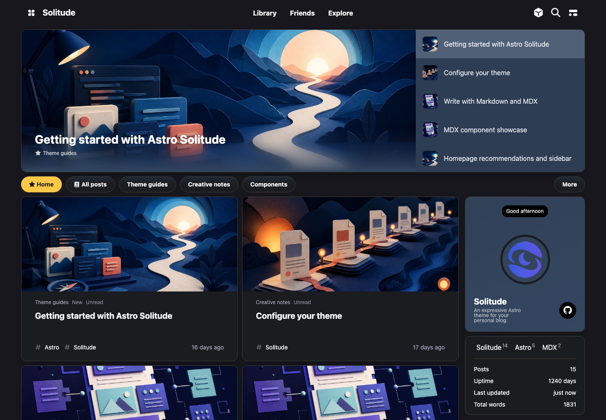
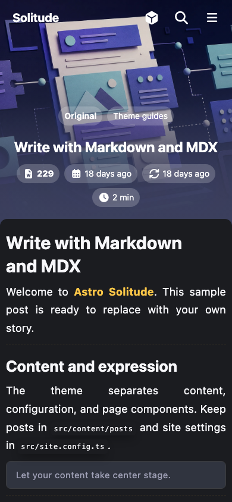

[English](README.md) 丨 简体中文

<div align="center">

# Astro Solitude

一款简洁、优雅、功能丰富的 Astro 博客主题。

以静态页面承载内容，搭配 Markdown / MDX 写作、明暗模式与丰富的内容组件，构建属于自己的个人博客。

[](https://astro.build/)
[](package.json)
[](LICENSE)
[](https://github.com/everfu/astro-solitude/actions/workflows/check.yml)
[](https://github.com/everfu/astro-solitude/stargazers)

[使用此模板](https://github.com/everfu/astro-solitude/generate) · [使用文档](docs/README.md) · [快速开始](#快速开始) · [主题配置](docs/configuration.md) · [内容组件](docs/components.md) · [部署指南](docs/deployment.md) · [问题反馈](https://github.com/everfu/astro-solitude/issues)

</div>


## 特性

- **布局与阅读**：响应式卡片首页、推荐文章、侧栏、文章目录、相关文章、版权与赞赏。
- **内容创作**：Markdown / MDX、41 个内容组件、Shiki 代码高亮、KaTeX 数学公式。
- **文章管理**：分类、标签、系列、归档、分页、置顶、草稿、自定义链接与别名。
- **特色页面**：关于、友链、我的装备、音乐馆、留言板、即刻短文、最近评论与 404 页面。
- **交互体验**：明暗模式、图片灯箱、快捷键、右键菜单与跨页面保留的音乐胶囊。
- **搜索与订阅**：本地搜索、Algolia、DocSearch、RSS 与 Sitemap。
- **评论系统**：Twikoo、Waline、Valine、Artalk、Giscus，按配置加载。
- **多语言界面**：简体中文、繁体中文、英语与西班牙语。
- **静态部署**：构建生成静态文件，可发布到静态托管平台或自建服务器。

## 快速开始

### 1. 获取项目

准备 Node.js **22.12.0+** 与 pnpm，pnpm 版本以 [package.json](package.json) 的 `packageManager` 为准。

点击 [Use this template](https://github.com/everfu/astro-solitude/generate) 创建自己的独立仓库，再克隆自己的副本（替换 `YOUR_NAME` 和 `my-blog`）：

```sh
git clone https://github.com/YOUR_NAME/my-blog.git
cd my-blog
pnpm install --frozen-lockfile
pnpm dev
```

打开终端提示的本地地址，即可预览主题与示例内容。

### 2. 配置站点

编辑 [`src/site.config.ts`](src/site.config.ts)，设置站点地址、标题、作者、导航和主题选项。以下是最小配置示例：

```ts
import { defineSolitudeConfig } from './lib/config';

export default defineSolitudeConfig({
  site: 'https://example.com',
  title: '我的博客',
  description: '记录生活，分享所见。',
  locale: 'zh-CN',
  author: { name: '你的名字' },
});
```

部署在子目录时，另外设置 `base`，例如 `base: '/blog/'`。完整选项见 [配置文档](docs/configuration.md)。

模板保留示例文章和特色页面，本地搜索开箱即用。评论、评论聚合和在线音乐默认关闭，服务标识为空；需要时按 [第三方集成指南](docs/integrations.md) 配置自己的服务。发布前替换示例内容、头像和站点信息。界面语言设置不会自动翻译文章或自定义导航。

### 3. 开始写作

在 `src/content/posts/` 中创建 Markdown 或 MDX 文件，例如 `hello-world.md`：

```md
---
title: 你好，世界
date: 2026-09-11
description: 我的第一篇文章。
tags: [生活]
---

从这里开始记录。
```

默认文章地址为 `/p/hello-world/`。可以通过 `slug`、`url` 和 `aliases` 调整地址；`draft: true` 用于草稿，`home: false` 可从首页各区域隐藏文章，同时保留归档、搜索、RSS 与直接访问。

更多写作能力见 [内容字段](docs/writing.md#front-matter) 与 [MDX 组件文档](docs/components.md)。

### 4. 构建与部署

```sh
pnpm build
pnpm preview
```

将生成的 `dist/` 目录发布到托管平台。构建命令为 `pnpm build`，输出目录为 `dist`；安装依赖时可使用 `pnpm install --frozen-lockfile`。

部署步骤与路径配置见 [部署指南](docs/deployment.md)。

## 文档

模板默认界面、示例内容与详细文档使用英文；可通过 `locale` 切换内置界面语言。

从 [文档首页](docs/README.md) 按步骤阅读，或直接选择当前任务：

| 指南                                | 内容                             |
| ----------------------------------- | -------------------------------- |
| [快速开始](docs/getting-started.md) | 创建模板副本、安装、第一篇文章   |
| [主题配置](docs/configuration.md)   | 站点信息、外观、导航与默认值     |
| [写作指南](docs/writing.md)         | 文章字段、草稿、分类、地址和订阅 |
| [特色页面](docs/pages.md)           | 关于、友链、装备与短文数据       |
| [内容组件](docs/components.md)      | 41 个 MDX 组件的用途、参数和示例 |
| [第三方集成](docs/integrations.md)  | 评论、弹幕、音乐与外部搜索       |
| [部署指南](docs/deployment.md)      | GitHub Pages、静态托管与子目录   |
| [Hugo 导入](docs/migration.md)      | 预检、导出与迁移验证             |
| [常见问题](docs/faq.md)             | 故障排查与更新主题               |

<details>
<summary>更多预览：深色模式与移动端阅读</summary>




</details>

## 项目结构

```text
astro-solitude/
├── public/                # 图片、字体等静态资源
├── src/
│   ├── components/        # 主题与 MDX 组件
│   ├── content/
│   │   ├── posts/         # 博客文章
│   │   └── pages/         # 自定义页面
│   ├── data/              # 关于、友链、装备、短文等页面数据
│   ├── layouts/           # 页面布局
│   ├── pages/             # Astro 路由
│   ├── styles/custom.css  # 自定义样式
│   └── site.config.ts     # 站点配置入口
├── docs/                  # 使用文档
└── astro.config.mjs       # Astro 配置
```

## 参与贡献

欢迎通过 [Issues](https://github.com/everfu/astro-solitude/issues) 反馈问题或提出建议，也欢迎提交 [Pull Request](https://github.com/everfu/astro-solitude/pulls) 改进主题、文档与翻译。反馈问题时，请提供复现步骤、运行环境和相关配置。

提交改动前，可运行以下检查：

```sh
pnpm docs:check
pnpm check
pnpm build
pnpm test
```

涉及页面交互时，可进一步运行浏览器测试：

```sh
pnpm build:fixture
pnpm exec playwright install chromium
pnpm test:e2e
```

浏览器测试使用独立测试站，第三方服务的模拟测试不代表线上服务已联调。测试范围与来源对照见 [开发验收记录](docs/parity.md)。

## 许可

[Apache-2.0](LICENSE) License © 2026–至今 [everfu](https://github.com/everfu)。二次分发与修改请保留相应许可及版权声明。
